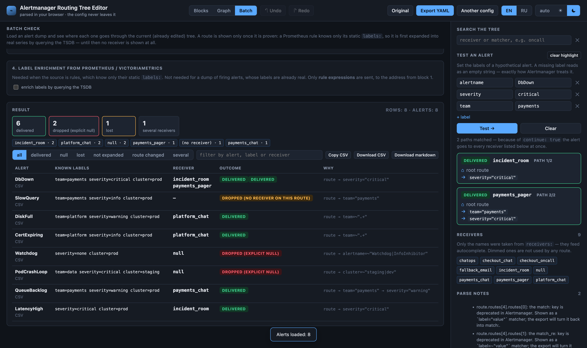
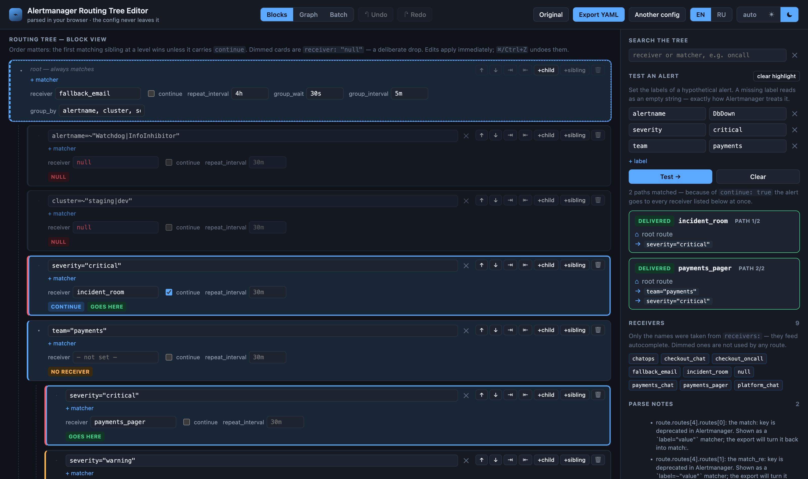
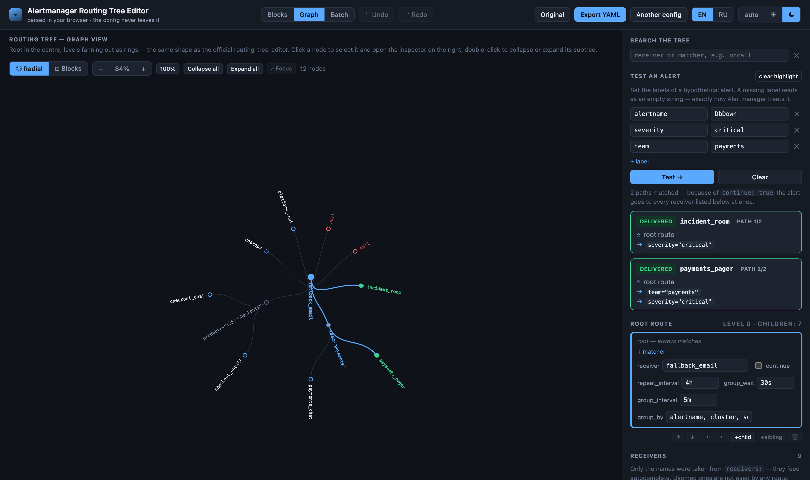

# Редактор дерева роутинга Alertmanager

**Часть ваших алертов не доходит ни до кого, и вам об этом никто не скажет.**

Ветка совпала, ни один её ребёнок не совпал, а своего `receiver`'а у ветки нет —
потому что в Alertmanager receiver никогда не наследуется от родителя. Алерт
выброшен. Ни ошибки, ни строчки в логе, ни следа на дашборде. Конфиг при этом
выглядит совершенно разумно:

```yaml
- matchers:
    - team="payments"
  routes:
    - receiver: payments_pager
      matchers: [severity="critical"]
    - receiver: payments_warn
      matchers: [severity="warning"]
    # severity="info" у этой команды не уходит никуда
```

Инструмент берёт ваше дерево роутинга и ваши алерты, прогоняет **все разом** и
выдаёт список тех, что не приходят никуда. Дальше дерево можно поправить и забрать
готовый YAML.

**[Живое демо →](https://green-po4tiapple.github.io/alertmanager-config-editor/?demo=1)**
· [English README](README.md)

Работает целиком в браузере. Без бэкенда, без установки, конфиг не покидает
страницу.



Строка `SlowQuery` — тот самый дефект сверху, найденный автоматически.

## Чем это лучше `amtool`

`amtool config routes test` — правильный инструмент для одного вопроса про один
алерт. Отвечает из консоли, один набор лейблов за вызов.

Здесь вопрос другой: **какие из всех моих алертов не доходят никуда** — и чтобы на
него ответить, нужен весь набор сразу. Скормите выгрузку `/api/v2/alerts`, дамп
`PrometheusRule` или CSV — каждый алерт получит строку. На боевой выгрузке из 322
горящих алертов так нашлись 66 выбрасываемых молча.

Ещё две вещи, которых `amtool` не делает: он не покажет дерево и не скажет, что
изменила ваша правка. Здесь после перемещения ветки каждая строка считается ещё и
по дереву **до правки** — видно «переадресовано 65 алертов из 332», а не
«изменилось 4 строки YAML».

## Что умеет

| | |
|---|---|
| **Пакетная проверка** | Выгрузка алертов → «алерт → receiver → почему», со счётчиком **потеряно**. Источники: `/api/v2/alerts` Alertmanager, `/api/v1/rules` Prometheus, дамп `PrometheusRule`, rule-файл, CSV. См. [`docs/BATCH-CHECK.md`](docs/BATCH-CHECK.md). |
| **Регрессия роутинга** | Каждая разрешённая строка считается и по дереву на момент загрузки, поэтому объём последствий правки — число, а не догадка. |
| **Два режима над одним деревом** | Вложенный список карточек с инлайн-правкой и диаграмма. Модель одна, переключение свободное. |
| **Две раскладки графа** | **Радиальная** — как в официальном routing-tree-editor. **Блоки** — org-chart сверху вниз с матчерами внутри узлов и drag&drop. |
| **Проверка алерта** | Произвольные пары `label=value` → все receiver'ы, куда уедет алерт, с исходом каждого: доставлено / дроп (явный null) / дроп (нет receiver'а). Путь подсвечивается в обоих режимах. |
| **Правка структуры** | Перемещение среди соседей, вложить/поднять, добавить, удалить, перетащить ветку на нового родителя. `⌘/Ctrl+Z` отменяет правку поля целиком, а не по символу. |
| **Экспорт** | Готовый блок `route:` либо ваш исходный файл с заменённым только этим блоком — комментарии и секреты переносятся байт в байт. |
| **Загрузка из живого Alertmanager** | `GET /api/v2/status` → `config.original`, вставлять руками ничего не нужно. |
| **Темы и языки** | Светлая/тёмная по системной настройке. Интерфейс на английском и русском. |

### Правка с открытой проверкой алерта



### Радиальная раскладка, как в оригинале



## Быстрый старт

Чтобы попробовать, ставить ничего не нужно —
[откройте демо](https://green-po4tiapple.github.io/alertmanager-config-editor/?demo=1)
и нажмите **Посмотреть на примере**. Локально:

```bash
npm ci
npm run dev        # http://127.0.0.1:5180
```

```bash
npm test           # юнит-тесты ядра (vitest)
npm run typecheck  # tsc --noEmit
npm run build      # прод-сборка в dist/
```

## Модель безопасности

Стоит прочитать до того, как вставлять боевой конфиг в страницу, которую вы только
что нашли.

- **Конфиг не покидает страницу.** Разбор, правка и экспорт происходят в браузере.
  Само по себе приложение никуда не ходит.
- **Наружу уходят только те запросы, которые вы запустили**, и только на адреса,
  которые вы ввели сами: загрузка конфига из Alertmanager, выгрузка правил и
  горящих алертов и — если включите — обогащение лейблов из
  Prometheus/VictoriaMetrics. В них едут пути API и выражения правил. **Дерево
  роутинга и вставленный конфиг не отправляются никогда.** Куки не передаются
  (`credentials: 'omit'`).
- **Ничего не сохраняется.** Конфиг живёт только в памяти вкладки: ни
  `localStorage`, ни `sessionStorage`. Перезагрузка даёт чистый экран вставки.
  Единственное исключение — выбранный язык.
- **Из `receivers:` читаются только имена.** Токены, URL и `*_configs` в состояние
  приложения не попадают вообще, включая sops-шифртексты в HelmRelease. На это есть
  тест.
- **Экспорт «весь файл» — текстовая подстановка**, а не пересборка YAML, поэтому
  секреты и комментарии исходного файла переносятся символ в символ.

Если этого мало — а для закрытого контура и должно быть мало — поднимите у себя:

```bash
docker build -t alertmanager-config-editor .
docker run --rm -p 8080:8080 alertmanager-config-editor   # http://localhost:8080
```

Образ — `nginx-unprivileged` (~76 МБ, слушает 8080, root не нужен, есть `/healthz`),
работает с read-only корневой файловой системой:

```bash
docker run --rm --read-only --user 101:101 --cap-drop ALL \
  --tmpfs /tmp --tmpfs /var/cache/nginx -p 8080:8080 alertmanager-config-editor
```

У self-hosting есть практический плюс: страница по обычному HTTP может обращаться к
`http://`-адресам, которые браузер со HTTPS-страницы блокирует как mixed content.

## Можно ли доверять экспорту

`npm test` кладёт в `amtool-out/` готовые конфиги Alertmanager, собранные
сериализатором этого проекта. Дальше CI проверяет их **настоящим** бинарём
Alertmanager — эта проверка уже забраковала конфиг, который юнит-тесты пропустили.
Локально то же самое:

```bash
npm test
docker run --rm -v "$PWD/amtool-out:/cfg" --entrypoint sh \
  prom/alertmanager:v0.28.1 -c 'amtool check-config /cfg/*.yaml'
```

Можно прогнать всё ядро по своему конфигу — без переменной тест пропускается:

```bash
AM_CONFIG=/path/to/alertmanager.yml npm test
```

Семантика роутинга переведена построчно из `dispatch/route.go` Alertmanager —
включая то, что легко понять неверно: `continue: true` даёт несколько receiver'ов,
а `label!~".*"` не совпадает никогда. См.
[`docs/ROUTING-SEMANTICS.md`](docs/ROUTING-SEMANTICS.md).

## Документация

- [`AGENTS.md`](AGENTS.md) — с этого начинайте, если собираетесь править код.
- [`docs/ARCHITECTURE.md`](docs/ARCHITECTURE.md) — слои, инварианты, точки
  расширения.
- [`docs/ROUTING-SEMANTICS.md`](docs/ROUTING-SEMANTICS.md) — точная семантика и
  грабли реальных конфигов.
- [`docs/YAML-DIALECT.md`](docs/YAML-DIALECT.md) — что принимает парсер и как
  сериализатор расставляет кавычки.
- [`docs/BATCH-CHECK.md`](docs/BATCH-CHECK.md) — пакетная проверка подробно.

Документация и комментарии в коде — на английском; этот файл и русский интерфейс
существуют для русскоязычных пользователей.

## Лицензия

MIT — см. [LICENSE](LICENSE).
